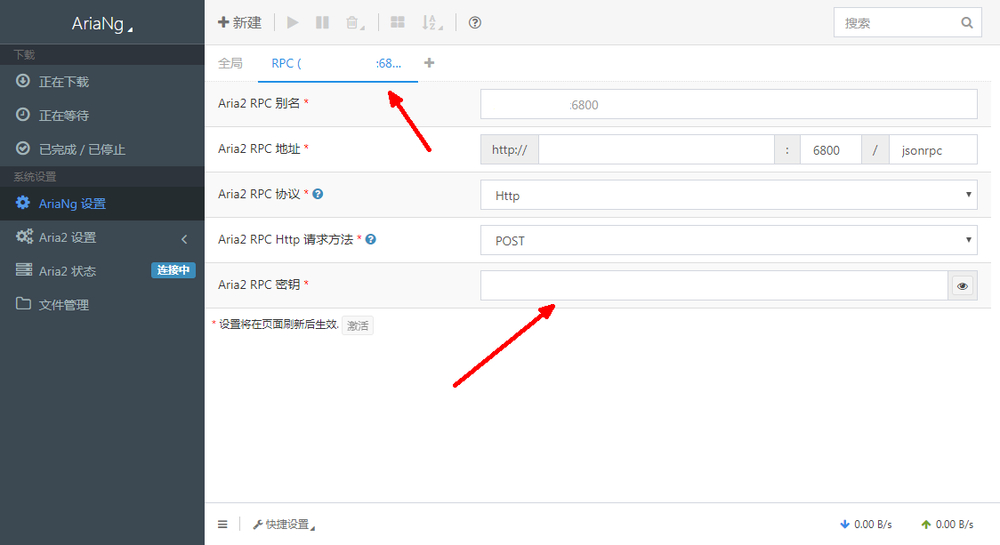

# CCAA Docker快速部署镜像 #

## 原贴链接 ##
链接：[小z博客 - CentOS 7一键安装Caddy + Aria2 + AriaNg实现离线下载](https://www.xiaoz.me/archives/11250)

## 安装方法 ##
使用命令(标记的内容为需要自行设置的内容, 在有多个容器部署的情况下需要按情况设置)：
```bash
docker run -it -p ${RPC端口}:6800 -p ${Web面板端口}:6080 -v ${外部下载路径}:/data/Download lamgc/aria2ng
```
创建新的容器, 第一次运行容器时会要求设置新的Web面板密码和RPC秘钥密码：
```
Output:
检测到容器第一次运行, 进行密码设置...
初始化登录密码...
请设置AriaNG登录密码(仅限大小写字母和数字, 不填写则为随机密码, 设置完毕后显示): 
请设置Aria2 RPC密码(仅限大小写字母和数字, 不填写则为随机密码, 设置完毕后显示): 
```
如不设置密码, 则会随机生成16位密码并在完成初始化后显示：
```
-------------------------------------------------------------
大功告成！你的Aria2已经准备就绪！
访问：http://ServerIp:6080/#!/settings/ariang 来进行最后一步操作 -> 设置RPC秘钥
登录用户名: admin
登录密码：57340330715f8902
Aria2 RPC 密钥:  cd4a77558e660f752352c738xxxxxxxx
如果无法访问, 请检查容器是否映射了6080端口和6800端口！
帮助文档: https://dwz.ovh/ccaa （必看）
-------------------------------------------------------------
```
如主动设置, 则初始化完成后不会显示密码：
```
登录密码：(用户已设置)
```
初始完毕后, 打开浏览器, 输入提示中的地址, 使用用户名和密码登录Web面板, 转到AriaNG设置

将初始化后的RPC秘钥填入后刷新网页，左侧`Aria2 状态`显示`已连接`后即安装成功。

## 需要外部设置的 ##
下载路径：`/data/Download`, 需要映射到外部,除非不需要在外面存储<br/>
需要开放的端口：`6080`(web面板), `6800`(RPC端口)

## 目前已知的问题 ##
- 如果通过浏览器隐私/无痕模式访问时设置RPC秘钥，秘钥将会在设置后被清除。（原因：AriaNG将秘钥保存在Cookie中）
    - 暂时的解决方法：妥善保管RPC秘钥，下一个版本将会使RPC秘钥能够自行设置。

## 更新日志 ##
- 1.0.3
  - 添加了对`RPC秘钥`的设置, 容器第一次运行时可以对`RPC秘钥`进行设置, 也可以留空, 随机生成。
- 1.0.2
  - 添加了`upbt.sh`脚本，让用户能够更新BT服务器。
- 1.0.1
  - 修复初始化阶段设置密码时密码回显的情况
    - 修复后输入密码不回显, docker logs将无法查看密码的输入, 提高安全性;
  - 修复ccaa安装管理脚本为安装脚本的问题
    - 修复后将可以通过`/root/ccaa-install.sh`脚本管理ccaa的安装与卸载

- 1.0.0
  - 第一个可以投入使用的版本
